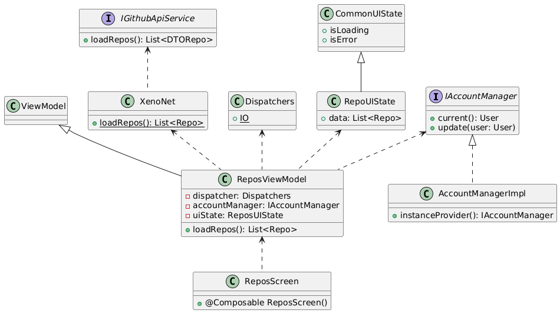

# Features
- Browse the highest-starred projects from the past week on the homepage.
- Search repositories by keywords or programming language, and sort results by star count.
- Log in using GitHub OAuth with persistent login status, and log out anytime.
- After logging in, tap a repository to view its issues. Submit new issues if it’s your own repository.
- Supports both portrait and landscape orientations with adaptive layouts, and preserves LazyColumn scroll positions separately for each screen orientation.
- Handles errors like network failures, empty results, and more.

# Build
run `./gradlew assembleRelease --stacktrace` to build project into apk archive

# Test
run `./gradlew app:koverHtmlReport` to generate test coverage report for this project, you can find it in `app/build/reports/kover/html/index.html`

# UML

# APK
[XenoGithub.apk](archives/XenoGithub-1.0.0-202503081450.apk)